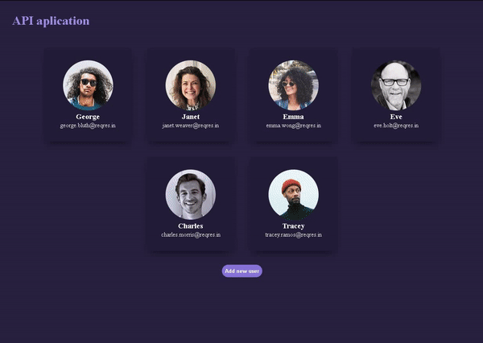

<h2 align="center"> api-consumption </h2>
<h3 align="center">Esse é projeto feito com o framework Flask, do Python. O intuito dele foi consumir uma <a href="https://reqres.in">API</a> que gera dados falsos (feitos para praticar)</h3>

-> Características/funcionalidades: 

<ul>
  <li>O projeto possui funcionalidades de criar, deletar ou alterar um usuário</li>
  <li>Os dados da API são obtidos por request GET</li>
  <li>Os dados são armazenados em um arquivo .csv</li>
  <li>Por causa do arquivo, é possível criar, alterar ou deletar o usuário. Essa foi a única forma de eu poder controlar os dados livremente (a api obviamente não deixaria exclui-los ou alterá-los)</li>
</ul>

  

